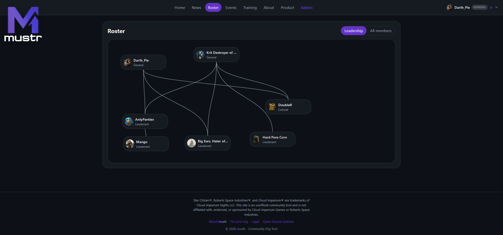
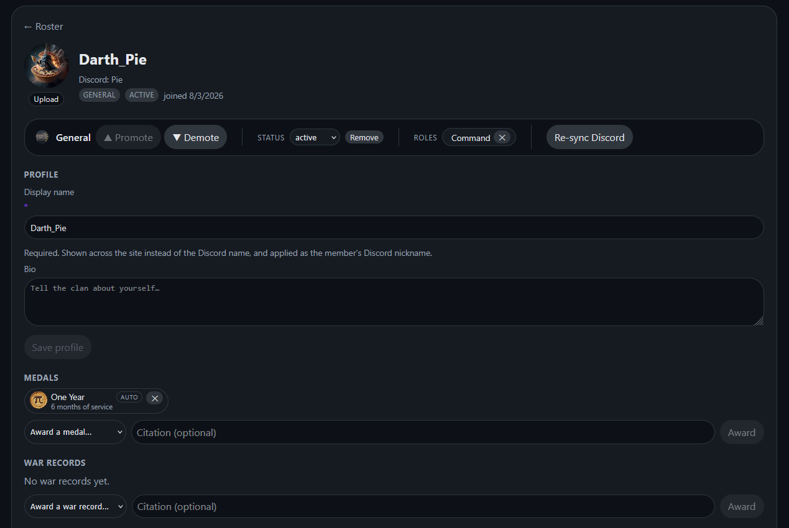
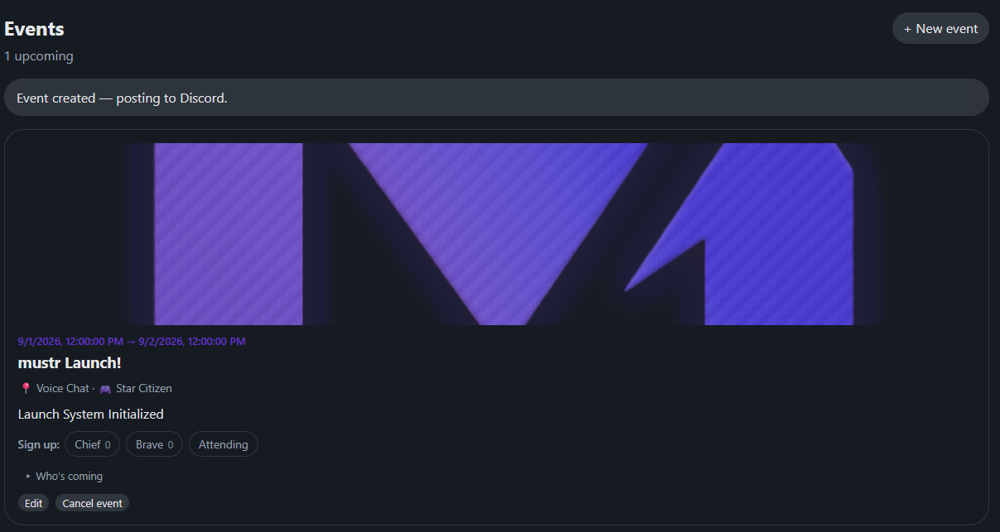
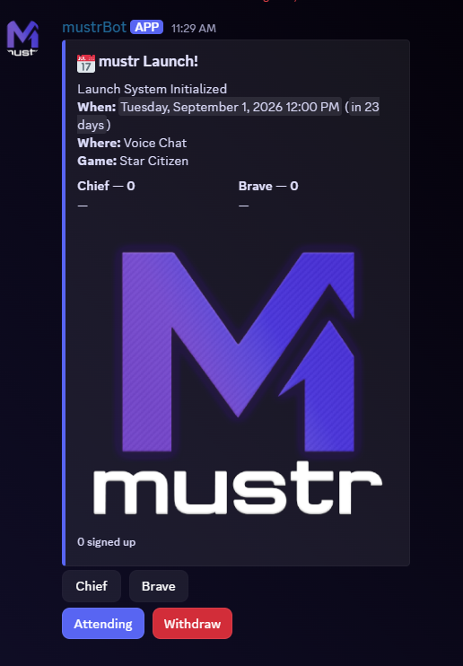
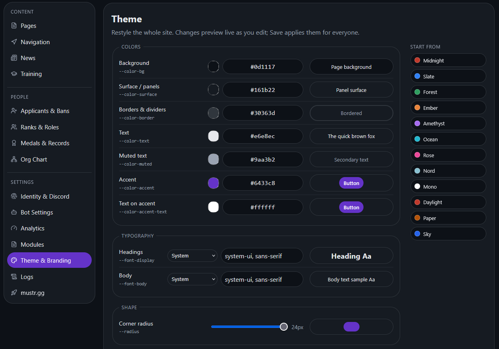
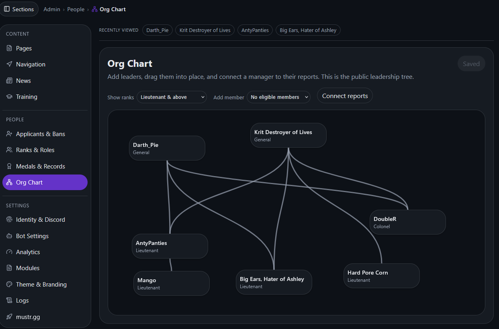

### Community tools for gaming orgs — minus the busywork.

Roster, ranks, roles, events, training, tournaments, and a real website — all synced with
Discord, running on Cloudflare's free tier for about nothing.

**[Live demo](https://mustr.gg)** · **[What it does](https://mustr.gg/product)** · **[Setup guide](https://mustr.gg/setup)** · **[About the bot](https://mustr.gg/bot)**

`Free · Self-hosted · FSL-1.1-MIT · New in 2026`

---

## What is mustr?

**mustr** is a self-hosted community site for gaming organizations. You run your own copy
on your own Cloudflare account — **your data, your server, no monthly bill, no company in
the middle**. It keeps your website and your Discord in sync, so you stop updating six
things by hand.

It's the modern rebuild of **ClanTek**, a clan site first built back in 2003.

 
<em>Your public roster as a living leadership tree — ranks, avatars, and reporting lines, all fed from Discord.</em>

---

## Everything it does

### 🪖 People, ranks & Discord — in two-way sync

A rank ladder and roles that stay **synced both ways** with Discord: promote someone on the
site and their Discord role, color, and nickname update themselves — and the reverse holds
too. Every member gets a profile with a bio, avatar, medals, and service records.

- **Ranks & roles** with a website-authoritative reconcile loop (no drift)
- **Apply-to-join** — approve applicants, with a real, persistent **ban list**
- **Audit log** — every promotion, demotion, and award recorded **with a reason**
- **Org chart** — a drag-and-drop leadership tree that *is* your public roster

 
<em>A member profile — one-click promote/demote, role grants, Discord re-sync, and auto-awarded service medals.</em>

### 📅 Events & competition

Plan it once and it lands everywhere. Events create a native Discord scheduled event **and**
a live sign-up sheet in your channel; members RSVP to specific slots (Tank / Healer / DPS,
or whatever you define) on the site **or** in Discord, and it all reconciles to one list.

- **Events wired to Discord** — per-slot sign-ups, RSVPs, banners, and **recurring events**
- **One-tap check-in** that feeds attendance scoring
- **Tournaments** — single/double elimination, round-robin, or Swiss, for **individuals or teams**; auto-seeding, auto-advancing results, live standings, and an automatic champion medal

<table>
<tr>
<td width="50%"></td>
<td width="50%"></td>
</tr>
</table>

<em>The same event on your site and in your Discord — sign-ups on either side sync to one shared roster.</em>

### 📊 Engagement & recognition

- **Attendance & participation** — check-in scores, **leaderboards**, and a GitHub-style activity heatmap on every profile, with milestone medals awarded automatically
- **Medals & service records** — recognize the people who show up; tenure medals award themselves
- **Training** — embed Google Slides, mark courses **required per rank**, and track who's completed them

### 🎨 Your own site, your way

mustr isn't a fixed template — it's a little site builder. Arrange your pages from
drag-and-drop **modules** (news, roster, events, tournaments, galleries, embeds, and more),
restyle **everything** live, and make it yours.

- **Page builder** — a responsive module grid with role-gated visibility and custom pages
- **Themes & skins** — 12 color presets plus **6 surface styles** (Classic / Soft / Sharp / Glass / Neon / Flat), your own fonts, colors, radius, and logo — members can even pick a personal skin
- **Branding** — the **Sigil Forge** turns your mark into an animated brand kit (splash, loaders, login, Discord-embed crests)
- **Galleries & media** — image galleries with a lightbox + embedded YouTube/Twitch (no video-hosting bills)
- **Installable (PWA)** and **accessible by default** — a per-person text-size slider and a high-contrast mode

 
<em>Restyle the whole site live — colors, type, and corner radius, with a dozen presets to start from.</em>

### 🛡️ Admin & safety

- **One-click backups** — the owner can snapshot the whole site and restore it in a click if someone breaks something
- **Notifications & audit log** — role-gated announcements, plus a full, reasoned history of admin actions
- **Fine-grained roles & permissions** — gate every tool and page to exactly who should see it
- **Analytics** — live R2/D1 usage against the free-tier limits, right in the admin

 
<em>The admin panel — a WordPress-style shell with every tool one click away.</em>

### 🤖 A Discord bot that does more than sync

The bot posts embeds, pings the right people, and puts your tools **inside Discord**:

- **Slash commands** — `/whois`, `/roster`, `/event`, `/tournament`, `/medals`, `/rank`, `/promote`
- **Buttons in your server** — event sign-up / check-in, and tournament registration
- Asks for **only** the permissions it uses (**never Administrator**) and **cannot read your messages** — it uses Discord's HTTP interactions, not the message gateway

### 🚀 Game modules

Optional, per-game extras an operator can toggle on. First up: a **Star Citizen** hangar
import + CCU planner. The framework is built to add more games over time.

**[→ See it all in action on the live demo](https://mustr.gg/product)**

---

## Deploy your own

You'll need a **Cloudflare account** (free), a **domain name** (~$10–15/yr from any
registrar), a **Discord server** you admin, and about **45 minutes**.

1. Click **[Deploy to Cloudflare](https://deploy.workers.cloudflare.com/?url=https://github.com/Darth-Pie/mustr)**. It forks this repo into your GitHub, then **creates your Worker, database (D1), and file storage (R2) automatically** and asks you to invent a `SETUP_TOKEN` and a `SESSION_SECRET`.
2. Attach your domain (Cloudflare dashboard → your worker → **Settings → Domains & Routes**).
3. Open your site — the **first-run setup wizard** walks you through connecting Discord and claiming ownership.

The full, no-jargon walkthrough lives at **[mustr.gg/setup](https://mustr.gg/setup)**.

> **Heads up:** mustr is self-hosted and **support-free by design**. It's built to not need
> me — the setup guide and the code are your manual. That's the trade for "free, forever,
> nobody can rug-pull it."

## About the bot

mustr's Discord bot asks for **only** the handful of permissions it actually uses (**never
Administrator**), and it **cannot read your messages** — it uses Discord's HTTP interactions,
never the message gateway. The plain-English rundown a wary member can read:
**[mustr.gg/bot](https://mustr.gg/bot)**.

## Cost

It runs inside Cloudflare's free tier. The only guaranteed cost is your domain name. The
[honest cost & terms breakdown, with a live estimator](https://mustr.gg/about) has the receipts.

## Built with

[Cloudflare Workers](https://developers.cloudflare.com/workers/) · **D1** (SQLite via Drizzle) ·
**R2** · **Durable Objects** · [Hono](https://hono.dev/) · **React 19** + **Vite** · **TypeScript**

## License

Source code: **[Functional Source License 1.1 (MIT Future)](LICENSE)** — free to run,
self-host, modify, and read. It converts to the plain MIT license two years after each
release. You may **not** sell a competing product or service built from it.

The names **"mustr"** and **"ClanTek"**, the mustr wordmark, and the logo are reserved
trademarks — run it and fork it freely, but a redistributed copy must use its **own** name.

## Support

mustr is free. If it saves your org some headaches,
**[♥ become a Founder on GitHub Sponsors](https://github.com/sponsors/Darth-Pie?frequency=one-time)** — a
one-time thank-you, entirely optional, and the whole thing works free forever either way.
