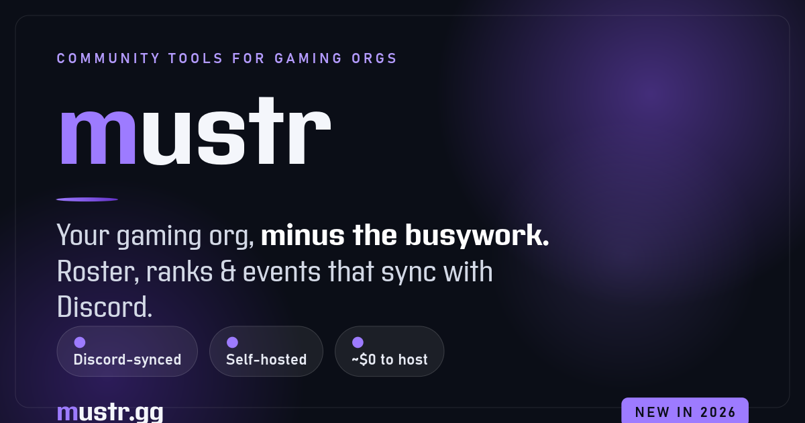

### Community tools for gaming orgs — minus the busywork.

Roster, ranks, roles, events, training, and a real website — all synced with Discord,
running on Cloudflare's free tier for about nothing.

**[Live demo](https://mustr.gg)** · **[What it does](https://mustr.gg/product)** · **[Setup guide](https://mustr.gg/setup)** · **[About the bot](https://mustr.gg/bot)**

`Free · Self-hosted · FSL-1.1-MIT · New in 2026`

---

## What is mustr?

**mustr** is a self-hosted community site for gaming organizations. You run your own copy
on your own Cloudflare account — **your data, your server, no monthly bill, no company in
the middle**. It keeps your website and your Discord in sync, so you stop updating six
things by hand.

It's the modern rebuild of **ClanTek**, a clan site first built back in 2003.

## What it does

- 🪖 **Roster, ranks & roles** — a rank ladder and roles that stay in **two-way sync with Discord** (promote on the site, Discord roles and nicknames update themselves)
- 📅 **Events wired to Discord** — sign-up slots and RSVPs on the site *or* in Discord, recurring events, and one-tap **check-in** — all on one shared list
- 🏆 **Tournaments** — run single/double elimination, round-robin, or Swiss brackets for individuals *or* teams; auto-seeding, auto-advancing results, live standings, and a champion medal
- 📊 **Attendance & participation** — check-in scores, leaderboards, and a GitHub-style activity heatmap on every profile, with milestone medals awarded automatically
- 🎖️ **Medals & service records** — recognize the people who show up
- 🎓 **Training** — embed Google Slides, mark courses required per rank, track who's completed them
- 🖼️ **Galleries & media** — image galleries with a lightbox + embedded YouTube/Twitch (no video-hosting bills)
- 🕸️ **Org chart** — a drag-and-drop leadership tree that doubles as your public roster
- 🤝 **Apply-to-join & bans** — approve applicants, keep a real ban list
- 🧩 **Build your own pages** — drag-and-drop modules, a dozen themes, your own logo & colors, installable as an app (PWA)
- ♿ **Accessible by default** — a per-person text-size slider and a high-contrast theme, for members who need them
- 🛟 **One-click backups** — the owner can snapshot the whole site and restore it in a click if someone breaks something
- 🔔 **Notifications & audit log** — role-gated announcements, plus every promotion, demotion, and medal logged with a reason
- 🤖 **A Discord bot that does more than sync** — slash commands (`/whois`, `/roster`, `/event`, `/tournament`, `/medals`, `/rank`, `/promote`) and sign-up / check-in / tournament buttons right in your server
- 🚀 **Game modules** — optional per-game extras (first up: a Star Citizen hangar import + CCU planner)

**[→ See it all in action](https://mustr.gg/product)**

## Deploy your own

You'll need a **Cloudflare account** (free), a **domain name** (~$10–15/yr from any
registrar), a **Discord server** you admin, and about **45 minutes**.

1. Click **[Deploy to Cloudflare](https://deploy.workers.cloudflare.com/?url=https://github.com/Darth-Pie/mustr)**. It forks this repo into your GitHub, then **creates your Worker, database (D1), and file storage (R2) automatically** and asks you to invent a `SETUP_TOKEN` and a `SESSION_SECRET`.
2. Attach your domain (Cloudflare dashboard → your worker → **Settings → Domains & Routes**).
3. Open your site — the **first-run setup wizard** walks you through connecting Discord and claiming ownership.

The full, no-jargon walkthrough lives at **[mustr.gg/setup](https://mustr.gg/setup)**.

> **Heads up:** mustr is self-hosted and **support-free by design**. It's built to not need
> me — the setup guide and the code are your manual. That's the trade for "free, forever,
> nobody can rug-pull it."

## About the bot

mustr's Discord bot asks for **only** the handful of permissions it actually uses (**never
Administrator**), and it **cannot read your messages** — it uses Discord's HTTP interactions,
never the message gateway. The plain-English rundown a wary member can read:
**[mustr.gg/bot](https://mustr.gg/bot)**.

## Cost

It runs inside Cloudflare's free tier. The only guaranteed cost is your domain name. The
[honest cost & terms breakdown, with a live estimator](https://mustr.gg/about) has the receipts.

## Built with

[Cloudflare Workers](https://developers.cloudflare.com/workers/) · **D1** (SQLite via Drizzle) ·
**R2** · [Hono](https://hono.dev/) · **React 19** + **Vite** · **TypeScript**

## License

Source code: **[Functional Source License 1.1 (MIT Future)](LICENSE)** — free to run,
self-host, modify, and read. It converts to the plain MIT license two years after each
release. You may **not** sell a competing product or service built from it.

The names **"mustr"** and **"ClanTek"**, the mustr wordmark, and the logo are reserved
trademarks — run it and fork it freely, but a redistributed copy must use its **own** name.

## Support

mustr is free. If it saves your org some headaches,
**[♥ support it on GitHub Sponsors](https://github.com/sponsors/Darth-Pie)** — entirely
optional, and the whole thing works free forever either way.
